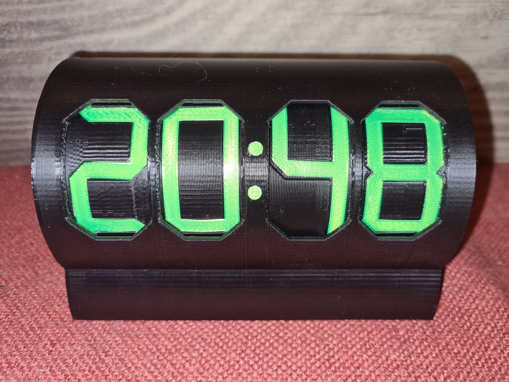

# OverlappingSegmentClock
## An digital clock controlled from internet-time via ESP8266 
https://github.com/xSnowHeadx/OverlappingSegmentClock

README file  
SnowHead Apr 2022  

## Introduction
[Shiura on thingiverse](https://www.thingiverse.com/thing:5356334) designed an fascinating cylindric clock where the clever usage of overlapped segment patterns allows an incredible height of the displayed digits. 
The original is controlled by an ESP32. The firmware here was adapted to an ESP8266 and for the use of the [WTA-timeservice](http://worldtimeapi.org) instead of NTP. So there normally are no firmware-modifications necessary to adapt the timezone and DST because they will be investigated out of the public IP of the request. For special cases (f.e. the use of a foreign proxy server) the timezone can be selected manually by replacing "ip" with the wished [timezone](http://worldtimeapi.org/timezone) in WTAClient.cpp. 

## Used libraries:
- ArduinoJson 
- DNSServer 
- DoubleResetDetector 
- ESP8266HTTPClient 
- ESP8266WebServer 
- ESP8266WiFi 
- WiFiManager  

## Switches in digit.h
<table>
<body>
<tr>
<td>PRE_MOVE</td><td>true to start cylinder movement earlier to reach the target position just in time</td>
</tr><tr> 
<td>DEBUG</td><td>true for additional debug messages on serial console</td>
</tr> 
</body></table>
